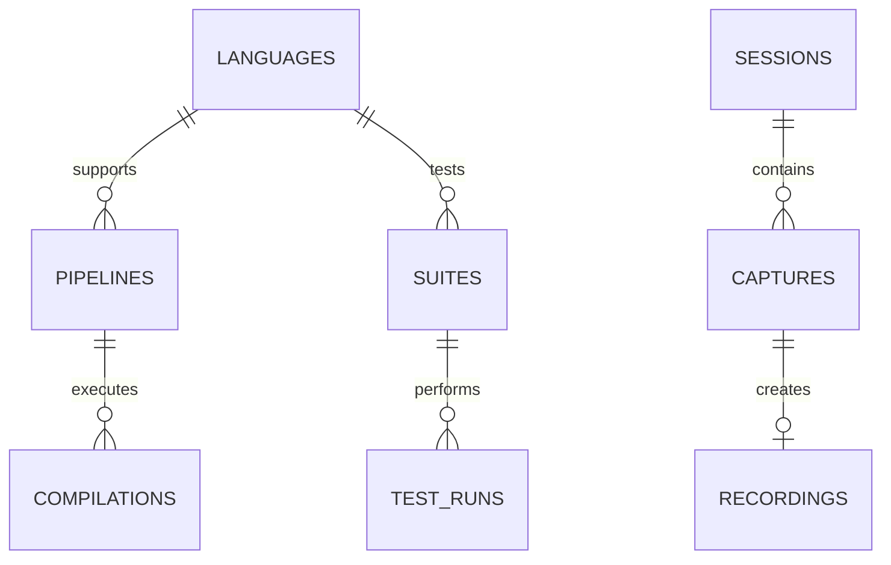

# JITIR Database Architecture
## Just-In-Time Information Retrieval System

### Executive Summary
A comprehensive database schema designed for the Guile Multilanguage Examples project, implementing JITIR principles for rapid information retrieval and demo capture on FreeBSD 14.3.

---

## 🏗️ Schema Overview

### Core Schemas
1. **`jitir`** - Metadata and retrieval optimization
2. **`multilang`** - Language compilation and processing
3. **`demos`** - Recording and session management
4. **`development`** - Environment configuration and testing

---

## 📊 Primary Entity Relationships



---

## 🔑 Key Tables

### JITIR Core
| Table | Purpose | Key Features |
|-------|---------|--------------|
| `retrieval_contexts` | Context classification | Priority-based retrieval |
| `information_nodes` | Polymorphic data storage | JSONB payload, scoring |

### Language Processing
| Table | Purpose | Key Features |
|-------|---------|--------------|
| `supported_languages` | Language registry | Status tracking, version requirements |
| `compilation_pipelines` | Transformation paths | Stage definitions, metrics |
| `compilation_history` | Execution log | Source hashing, performance data |

### Demo Management
| Table | Purpose | Key Features |
|-------|---------|--------------|
| `recordings` | Media storage | Multi-format support, tagging |
| `demo_sessions` | Session tracking | Command history, tmux integration |
| `instant_captures` | Hotkey captures | Ring-buffer recording, auto-conversion |

### Development
| Table | Purpose | Key Features |
|-------|---------|--------------|
| `emacs_config` | IDE configuration | Package management, keybindings |
| `git_submodules` | Dependency tracking | Version control, categorization |
| `test_runs` | Test execution | Result aggregation, artifacts |

---

## 🚀 JITIR Features

### Fast Retrieval Mechanisms
1. **GIN Indexes** on JSONB columns for full-text search
2. **B-tree Indexes** on timestamps for temporal queries
3. **Hash Indexes** on source code for deduplication
4. **Materialized Views** for common access patterns

### Information Scoring
- Retrieval score tracking
- Access count monitoring
- Last-accessed timestamps
- Priority-based contexts

---

## 📈 Performance Optimizations

### Indexing Strategy
```sql
-- Content-based retrieval
CREATE INDEX USING GIN(payload);

-- Temporal access patterns  
CREATE INDEX ON created_at DESC;

-- Tag-based discovery
CREATE INDEX USING GIN(tags);

-- Hash-based deduplication
CREATE INDEX ON source_hash;
```

### Partitioning Considerations
- `compilation_history` by month for time-series data
- `recordings` by type for media optimization
- `test_runs` by suite for parallel testing

---

## 🔄 Data Flow

```
Source Code → Compilation Pipeline → Execution Result
     ↓              ↓                      ↓
  Hashing      Stage Tracking         JITIR Node
     ↓              ↓                      ↓
  History      Performance            Retrieval
```

---

## 📊 Views for Quick Access

### `jitir.active_demos`
Recent recordings with aggregated tags

### `jitir.language_status`
Compilation success rates and performance metrics

### `jitir.recent_captures`
Last 24 hours of instant captures with session context

---

## 🛠️ Stored Procedures

### `jitir.record_compilation()`
Atomic recording of compilation events with automatic:
- Pipeline resolution
- History tracking
- JITIR node creation
- Score initialization

---

## 💾 Data Retention Strategy

| Data Type | Retention Period | Archive Strategy |
|-----------|-----------------|------------------|
| Compilations | 90 days active | S3/Cold storage |
| Recordings | 30 days active | Compress + archive |
| Test Results | 180 days | Aggregate + archive |
| JITIR Nodes | Score-based | LRU eviction |

---

## 🔐 Security Considerations

1. **Row-Level Security** on sensitive configurations
2. **Encrypted storage** for API keys in metadata
3. **Audit logging** on compilation attempts
4. **Read-only views** for reporting

---

## 📈 Scalability Path

### Phase 1: Single Instance (Current)
- PostgreSQL 15+ on FreeBSD
- Local file storage for media
- In-memory caching

### Phase 2: Distributed
- Read replicas for queries
- CDN for media files
- Redis for hot data

### Phase 3: Cloud-Native
- Aurora PostgreSQL
- S3 for recordings
- ElastiCache for JITIR

---

## 🎯 JITIR Benefits

1. **Instant Retrieval** - Sub-millisecond access to recent compilations
2. **Context Awareness** - Priority-based information surfacing
3. **Demo Capture** - Ring-buffer recording with hotkey triggers
4. **Performance Tracking** - Automatic metrics collection
5. **Deduplication** - Hash-based source code management

---

## 📝 Sample Queries

### Find successful Elisp compilations
```sql
SELECT * FROM jitir.language_status 
WHERE language_code = 'elisp' 
AND successful_compilations > 0;
```

### Get recent instant captures
```sql
SELECT * FROM jitir.recent_captures 
WHERE trigger_key = 'option' 
ORDER BY capture_timestamp DESC;
```

### Retrieve high-score JITIR nodes
```sql
SELECT * FROM jitir.information_nodes 
WHERE retrieval_score > 0.8 
AND node_type = 'demo'
ORDER BY retrieval_score DESC;
```

---

## 🔄 Migration Path

```bash
# Create database
createdb -U postgres guile_multilang_jitir

# Apply schema
psql -U postgres -d guile_multilang_jitir -f JITIR-schema.sql

# Verify installation
psql -U postgres -d guile_multilang_jitir -c "\dt *.*"
```

---

## 📚 Related Documentation

- [JITIR-schema.sql](./JITIR-schema.sql) - Complete DDL
- [Project README](../README.md) - Project overview
- [PRESENTATION.md](../PRESENTATION.md) - Demo materials

---

*Generated for the Guile Multilanguage Examples project implementing JITIR principles for optimal information retrieval and demo management.*